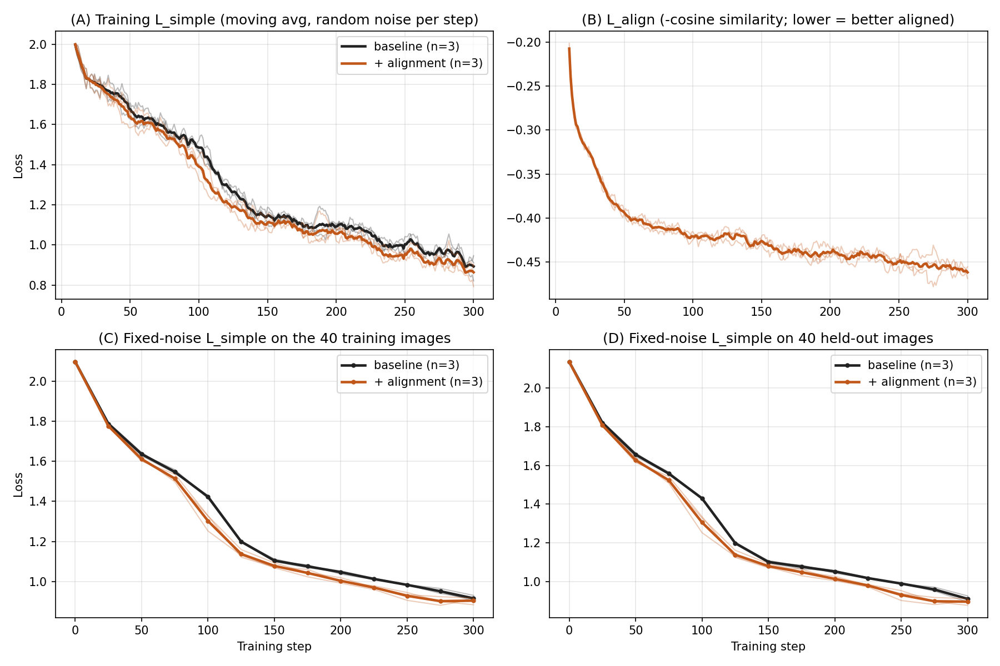

# SSL 기법을 활용한 Diffusion Model 학습 개선

한양대학교 컴퓨터소프트웨어학부 졸업프로젝트 (2026-1 ~ 2026-2)

- 학생: 이승민 (2023075541)
- 지도교수: 이성윤

자기지도학습(SSL) 표현 정렬(REPA, REG)이 SiT 기반 확산 모델의 학습에 주는 영향을 조사하고,
공식 모델 생성 재현과 소규모 정렬 학습 비교 실험을 수행했습니다.

[](https://colab.research.google.com/github/tmdals0611/ssl-diffusion-graduation/blob/main/notebooks/demo.ipynb)

## 프로젝트 개요

1. 공식 모델 재현: SiT, REPA, REG 공식 코드·체크포인트로 이미지 생성
2. 코드 대조: 공식 REPA 코드와 직접 작성한 학습 스크립트 비교 (`docs/repa_code_comparison.md`)
3. 소규모 학습 비교: SiT-S/2 baseline vs. REPA 방식 정렬(DINOv2-small), 시드 3개

### 소규모 실험 결과 (SiT-S/2, 4클래스 40장, 300스텝, n=3 시드)



- held-out 고정 노이즈 L_simple (step 250~300 평균): baseline 0.9528, + 정렬 0.9082
- 시드별 차이 (baseline − 정렬): 0.0582 / 0.0366 / 0.0391 (3시드 모두 정렬이 낮음)
- L_align (−cosine): −0.21 → −0.47 (정렬 조건)

해석: 학습 초기에 정렬 loss를 추가한 모델의 held-out 손실이 일관되게 조금 낮았습니다.
이는 생성 품질 향상이나 대규모 학습에서의 수렴 가속을 보인 것이 아닙니다 (아래 한계 참고).

## 저장소 구조

```
notebooks/demo.ipynb     전체 실행 노트북 (Colab Pro, T4)
src/train_align.py       직접 작성한 학습 스크립트 (SiT 공식 train.py 기반 + 정렬 loss + held-out 평가)
results/                 결과 그림, results/csv 에 시드별 metrics.csv / eval.csv
docs/                    공식 REPA 코드 대조표, 결과보고서
third_party/README.md    외부 코드 출처
```

## 재현 방법

1. Colab 에서 위 배지를 눌러 `notebooks/demo.ipynb` 를 엽니다. 런타임은 GPU(T4)를 선택합니다.
2. 셀을 위에서부터 순서대로 실행합니다.
   - REG 체크포인트(약 21.9GB) 다운로드에 약 16분이 걸립니다.
   - 런타임이 초기화되면 `/content` 가 지워지므로, 저장소와 데이터는 처음부터 다시 받아야 합니다.
3. 소규모 실험만 재현하려면 Toy 데이터 생성 셀 → `train_align.py` 작성 셀 → 학습 셀 → 비교 그림 셀 순으로 실행합니다.

환경: Python 3.13, PyTorch 2.11.0+cu130, Tesla T4 (15.6GB). 패키지는 `requirements.txt` 참고.

## 실행 중 겪은 문제와 해결

- `huggingface-hub` 2.x 설치 시 transformers/diffusers import 오류 → `huggingface-hub>=1.5.0,<2.0` 으로 고정
- 단일 GPU 에서 NCCL 이 멈춤 → `dist.init_process_group("gloo")` 사용
- PyTorch 2.6 이후 `torch.load` 기본값 변경으로 REG 체크포인트 로드 실패 → `weights_only=False` 패치
- REG `requirements.txt` 의 `tensorflow==2.16.1` 이 Python 3.13 에서 설치 불가 → 필요한 패키지만 개별 설치
- 런타임 초기화로 저장소·데이터 소실 → 재클론, 결과는 Drive 에 저장
- SiT-S/8 은 토큰 16개, DINOv2 는 256개로 불일치 → SiT-S/2 사용 (토큰 256개)

## 한계

- **FID 는 직접 측정하지 않았습니다.** 보고서와 노트북에 나오는 FID(SiT 2.06, REPA 1.42, REG 1.36)는 논문 보고값입니다.
- 3-way 비교 그림은 생성 조건이 서로 달라 모델 품질의 시각적 우열을 보여 주지 않습니다.
- 소규모 실험은 4클래스, 학습 40장, 300스텝, 시드 3개입니다.
- `train_align.py` 는 공식 REPA 와 정렬 구조(깊이 8, 3층 MLP projector, −cosine, λ=0.5)는 같지만, DINOv2-small 사용, 규모, EMA·FID 부재가 다릅니다. **"REPA 방식의 소규모 재현"** 으로 읽어 주세요.
- REG 방식의 학습(CLS 토큰 결합)은 구현하지 않았고, 공식 체크포인트로 생성만 했습니다.

## 참고문헌

- SiT: Ma et al., *SiT: Exploring Flow and Diffusion-based Generative Models with Scalable Interpolant Transformers*
- REPA: Yu et al., *Representation Alignment for Generation: Training Diffusion Transformers Is Easier Than You Think*
- REG: *Representation Entanglement for Generation*
- DINOv2: Oquab et al., *DINOv2: Learning Robust Visual Features without Supervision*

## 라이선스

이 저장소의 직접 작성 코드는 MIT 라이선스입니다. 외부 코드는 포함하지 않으며 각 저장소의 라이선스를 따릅니다.
